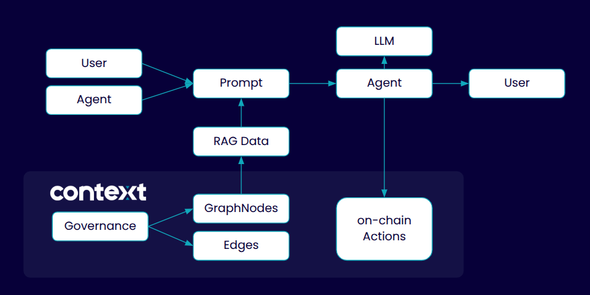

# Context Protocol
### L1 Blockchain for the AI Agentic Economy
The Internet is Becoming AI—It Needs a Secure, High-Throughput Foundation for Verified Data and Autonomous AI Interactions

## Overview
Context Protocol is based on a decentralized infrastructure for verifiable RAG (Retrieval-Augmented Generation) systems. It enables the creation of trusted, interconnected knowledge domains where data can be verified, traced, and securely shared between AI agents.

Think of Context Protocol as a decentralized knowledge graph where:
- Each node is a smart contract containing verified documents and data
- Nodes are connected through cryptographically secured edges (relations)
- Documents in nodes form the basis for RAG systems
- Relations between nodes allow RAGs to expand their knowledge domain by accessing verified data from connected nodes

### Key Components

#### Label Registry
A smart contract that defines and manages the types of nodes and their relationships. It acts as a schema registry ensuring data integrity and relationship validity across the network.

#### Context Nodes
Smart contracts that represent knowledge domains. Each node can:
- Store and manage documents for RAG systems
- Maintain verified properties
- Create validated connections with other nodes
- Control access to its knowledge domain

#### Verified Relations
Cryptographically secured connections between nodes that:
- Enable trusted knowledge sharing between RAGs
- Maintain data provenance
- Allow controlled access to connected knowledge domains

## Architecture



## Repository Structure

```
packages/
├── contracts/       # Smart contracts for nodes and registry
├── sdk/            # TypeScript SDK for interaction
└── utils/          # Shared utilities and helpers
```

## Documentation

- [Smart Contracts](./packages/contracts/README.md) - Core contracts documentation
- [SDK](./packages/sdk/README.md) - SDK usage and integration guides
- [Utils](./packages/utils/README.md) - Utility functions and helpers

## Quick Start

```typescript
// Create a knowledge domain node
const node = new ContextNode({ debug: true });

// Add documents for RAG
await node.addDocument('ipfs://QmDocument1');
await node.addDocument('ipfs://QmDocument2');

// Create verified relation with another node
await node.edge('RELATED_TO', 'semantic-connection')
  .to(otherNodeAddress)
  .save();
```

## Use Cases

1. **Verified Training Data**
   - Create trusted data sources for AI training
   - Maintain data provenance and authenticity

2. **Interconnected Knowledge Domains**
   - Build networks of specialized knowledge
   - Share verified information between domains

3. **AI Agent Collaboration**
   - Enable secure knowledge sharing betwee